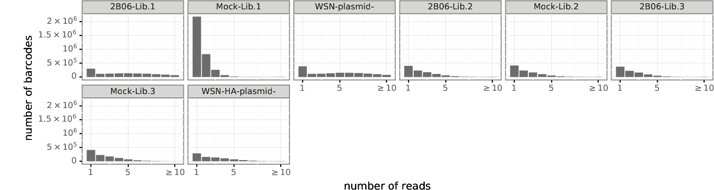

# Mutational antigenic profiling of D045-051310-2B06 antibody selection.
## The goal of this analysis notebook is to determine the comprehensive set of single amino-acid mutations in influenza A/WSN/33 hemagglutinin that allow for virus escape from the antibody D045-051310-2B06.
This antibody was provided by Patrick Wilson and previously characterized as a broadly cross-reactive HA [antibody](https://www.ncbi.nlm.nih.gov/pubmed/25689254). Deep mutational scanning experiments were performed by Lauren Gentles _in_ _vitro_. Selections were done using 50ug/mL of antibody and infections were performed on MDCK cells.


```python
import os
import pandas
from IPython.display import display, HTML
import dms_tools2
from dms_tools2.ipython_utils import showPDF

print("Using dms_tools2 version {0}".format(dms_tools2.__version__))

# results will go in this directory
resultsdir = './results/' 
if not os.path.isdir(resultsdir):
    os.mkdir(resultsdir)
    
# CPUs to use, should not exceed the number you request with slurm
ncpus = 14

# do we use existing results or generate everything new?
use_existing = 'yes'
```

    Using dms_tools2 version 2.4.10


```python
fastqdir = '/fh/fast/bloom_j/SR/ngs/illumina/lgentles/190419_M03100_0418_000000000-CCW7R/Data/Intensities/BaseCalls/'

samples = pandas.DataFrame(['WSN-HA-plasmid',
         '2B06-50ug',
         'Lib1-mock-rep2'], 
        columns=['origname'])
samples['R1'] = samples['origname'] + '_*_R1_*.fastq.gz'
samples['name'] = samples['origname'].str.replace('_', '-')

display(HTML(samples.to_html(index=False)))
```


<table border="1" class="dataframe">
  <thead>
    <tr style="text-align: right;">
      <th>origname</th>
      <th>R1</th>
      <th>name</th>
    </tr>
  </thead>
  <tbody>
    <tr>
      <td>WSN-HA-plasmid</td>
      <td>WSN-HA-plasmid_*_R1_*.fastq.gz</td>
      <td>WSN-HA-plasmid</td>
    </tr>
    <tr>
      <td>2B06-50ug</td>
      <td>2B06-50ug_*_R1_*.fastq.gz</td>
      <td>2B06-50ug</td>
    </tr>
    <tr>
      <td>Lib1-mock-rep2</td>
      <td>Lib1-mock-rep2_*_R1_*.fastq.gz</td>
      <td>Lib1-mock-rep2</td>
    </tr>
  </tbody>
</table>


```python
# file containing wildtype WSN HA sequence
refseq = './data/WSN-HA.fasta'

# define subamplicon alignment specifications
alignspecs = ' '.join(['1,285,36,37', 
                       '286,570,31,32',
                       '571,855,37,32',
                       '856,1140,31,36',
                       '1141,1425,29,33',
                       '1426,1698,40,43'])

# counts and alignments placed in this directory
countsdir = os.path.join(resultsdir, 'codoncounts')
if not os.path.isdir(countsdir):
    os.mkdir(countsdir)
    
# write sample information to a batch file for dms2_batch_bcsubamplicons
countsbatchfile = os.path.join(countsdir, 'batch.csv')
print("Here is the batch file that we write to CSV format to use as input:")
display(HTML(samples[['name', 'R1']].to_html(index=False)))
samples[['name', 'R1']].to_csv(countsbatchfile, index=False)

print('\nNow running dms2_batch_bcsubamp...')
log = !dms2_batch_bcsubamp \
        --batchfile {countsbatchfile} \
        --refseq {refseq} \
        --alignspecs {alignspecs} \
        --outdir {countsdir} \
        --summaryprefix summary \
        --R1trim 200 \
        --R2trim 170 \
        --fastqdir {fastqdir} \
        --ncpus {ncpus} \
        --use_existing {use_existing} 

print("Completed dms2_batch_bcsubamp.")
```

    Here is the batch file that we write to CSV format to use as input:


<table border="1" class="dataframe">
  <thead>
    <tr style="text-align: right;">
      <th>name</th>
      <th>R1</th>
    </tr>
  </thead>
  <tbody>
    <tr>
      <td>WSN-HA-plasmid</td>
      <td>WSN-HA-plasmid_*_R1_*.fastq.gz</td>
    </tr>
    <tr>
      <td>2B06-50ug</td>
      <td>2B06-50ug_*_R1_*.fastq.gz</td>
    </tr>
    <tr>
      <td>Lib1-mock-rep2</td>
      <td>Lib1-mock-rep2_*_R1_*.fastq.gz</td>
    </tr>
  </tbody>
</table>


    
    Now running dms2_batch_bcsubamp...
    Completed dms2_batch_bcsubamp.


# Make Summary Plots
The *_readstats.pdf summary plot shows the number of reads that were retained or thrown away due to low quality barcodes. The black regions indicate reads that failed the Illumina filter.


```python
countsplotprefix = os.path.join(countsdir, 'summary')
showPDF(countsplotprefix + '_readstats.pdf', width=700)
```


```python
showPDF(countsplotprefix + '_readsperbc.pdf')
```


```python
showPDF(countsplotprefix + '_bcstats.pdf', width=700)
```


```python
showPDF(countsplotprefix + '_depth.pdf')
```


```python
showPDF(countsplotprefix + '_mutfreq.pdf')
```


```python
showPDF(countsplotprefix + '_cumulmutcounts.pdf')
```





```python
showPDF(countsplotprefix + '_codonmuttypes.pdf', width=700)
```


```python
codonmuttypes = pandas.read_csv(countsplotprefix + '_codonmuttypes.csv').sort_index(axis=1)
display(HTML(codonmuttypes.to_html(index=False)))
```


<table border="1" class="dataframe">
  <thead>
    <tr style="text-align: right;">
      <th>name</th>
      <th>nonsynonymous</th>
      <th>stop</th>
      <th>synonymous</th>
    </tr>
  </thead>
  <tbody>
    <tr>
      <td>2B06-50ug</td>
      <td>0.001091</td>
      <td>0.000010</td>
      <td>0.000209</td>
    </tr>
    <tr>
      <td>Lib1-mock-rep2</td>
      <td>0.000741</td>
      <td>0.000027</td>
      <td>0.000223</td>
    </tr>
    <tr>
      <td>WSN-HA-plasmid</td>
      <td>0.000185</td>
      <td>0.000004</td>
      <td>0.000037</td>
    </tr>
  </tbody>
</table>


```python
showPDF(countsplotprefix + '_codonntchanges.pdf', width=700)
```


The *_singlentchanges.pdf plot below shows the frequency of each type of nucleotide change among only codon mutations with one nucleotide change. This plot is mostly useful to check if there is a large bias in which mutations appear. In particular, if you are getting oxidative damage (which causes G to T mutations) during the library preparation process, you will see a large excess of C to A or G to T mutations (or both). For instance, in the case of influenza, when we get bad oxidative damage, then we see an excess of C to A mutations in the final cDNA since the damage is occurring to a ssRNA genome. If you are sequencing something without polarity, you might see both types of mutations

It seems like I am seeing oxidative damage in my lib 1 mock sample. This is not entirely suprising since I used older amplicons from Juhye to generate this sample.


```python
showPDF(countsplotprefix + '_singlentchanges.pdf', width=700)
```


## Analyze differential selection
We first create a batch file to use with [dms2_batch_diffsel](https://jbloomlab.github.io/dms_tools2/dms2_batch_diffsel.html). Note that we make the group arguments such that the samples taken from the same day with the same virus dose are compared with appropriate no antibody controls using the counts files generated above with [dms2_batch_bcsubamp](https://jbloomlab.github.io/dms_tools2/dms2_batch_bcsubamp.html).

By grouping the replicates for the same antibody concentration and virus dose together in the batch file, we tell [dms2_batch_diffsel](https://jbloomlab.github.io/dms_tools2/dms2_batch_diffsel.html) to analyze these together and take their mean and median.


```python
diffseldir = os.path.join(resultsdir, 'diffsel')
if not os.path.isdir(diffseldir):
    os.mkdir(diffseldir)

diffselbatchfile = os.path.join(diffseldir, 'batch.csv')
    
# create batch file for dms2_batch_diffsel
diffselbatch = pandas.DataFrame.from_records([
              # WSN library 1 selected with 50ug/mL of D045_051310_2B06
              ('2B06', '2B06-50ug', '2B06-50ug', 'Lib1-mock-rep2'),
             ],
             columns=['group', 'name', 'sel', 'mock']
             )
diffselbatch['err'] = 'WSN-HA-plasmid' # all samples have the same error control which is the plasmid in this case

print("Here is the batch file that we write to CSV format to use as input:")
display(HTML(diffselbatch.to_html(index=False)))

diffselbatch.to_csv(diffselbatchfile, index=False)
```

    Here is the batch file that we write to CSV format to use as input:


<table border="1" class="dataframe">
  <thead>
    <tr style="text-align: right;">
      <th>group</th>
      <th>name</th>
      <th>sel</th>
      <th>mock</th>
      <th>err</th>
    </tr>
  </thead>
  <tbody>
    <tr>
      <td>2B06</td>
      <td>2B06-50ug</td>
      <td>2B06-50ug</td>
      <td>Lib1-mock-rep2</td>
      <td>WSN-HA-plasmid</td>
    </tr>
  </tbody>
</table>


```python
log = !dms2_batch_diffsel \
        --summaryprefix summary \
        --batchfile {diffselbatchfile} \
        --outdir {diffseldir} \
        --indir {countsdir} \
        --use_existing {use_existing}
```


```python
!ls {diffseldir}/
```

    2B06-2B06-50ug.log
    2B06-2B06-50ug_mutdiffsel.csv
    2B06-2B06-50ug_sitediffsel.csv
    batch.csv
    summary_2B06-absolutesitediffselcorr.pdf
    summary_2B06-maxmutdiffselcorr.pdf
    summary_2B06-meanmutdiffsel.csv
    summary_2B06-meansitediffsel.csv
    summary_2B06-medianmutdiffsel.csv
    summary_2B06-mediansitediffsel.csv
    summary_2B06-mutdiffselcorr.pdf
    summary_2B06-positivesitediffselcorr.pdf
    summary.log
    summary_meanmaxdiffsel.pdf
    summary_meanminmaxdiffsel.pdf
    summary_meanpositivediffsel.pdf
    summary_meantotaldiffsel.pdf
    summary_medianmaxdiffsel.pdf
    summary_medianminmaxdiffsel.pdf
    summary_medianpositivediffsel.pdf
    summary_mediantotaldiffsel.pdf


```python
diffselprefix = os.path.join(diffseldir, 'summary_')
groups = diffselbatch['group'].unique()

for seltype in ['mutdiffsel', 'positivesitediffsel']:
    print("\n{0} correlations:".format(seltype))
    plots = []
    for g in groups:
        plot = diffselprefix + g + '-' + seltype + 'corr.pdf'
        plots.append(plot)
    showPDF(plots[ : 3]) # show first 3 plots
    showPDF(plots[3 : ], width=800) # show remaining plots
```

    
    mutdiffsel correlations:


    ---------------------------------------------------------------------------

    IndexError                                Traceback (most recent call last)

    /fh/fast/bloom_j/software/conda/envs/BloomLab_v2/lib/python3.6/site-packages/dms_tools2/ipython_utils.py in showPDF(pdfs, width)
         41         # get temporary name for PNG file
    ---> 42         png = os.path.join(os.path.dirname(pdfs[0]), '._' +
         43                 os.path.splitext(os.path.basename(pdfs[0]))[0] + '.png')


    IndexError: list index out of range

    
    During handling of the above exception, another exception occurred:


    UnboundLocalError                         Traceback (most recent call last)

    <ipython-input-26-fdf06407fd60> in <module>
          9         plots.append(plot)
         10     showPDF(plots[ : 3]) # show first 3 plots
    ---> 11     showPDF(plots[3 : ], width=800) # show remaining plots
    

    /fh/fast/bloom_j/software/conda/envs/BloomLab_v2/lib/python3.6/site-packages/dms_tools2/ipython_utils.py in showPDF(pdfs, width)
         47         IPython.display.display(IPython.display.Image(png, width=width))
         48     finally:
    ---> 49         if os.path.isfile(png):
         50             os.remove(png)
         51 


    UnboundLocalError: local variable 'png' referenced before assignment


```python
showPDF([diffselprefix + 'meantotaldiffsel.pdf', diffselprefix + 'mediantotaldiffsel.pdf'])
```


```python
showPDF(diffselprefix + 'meanpositivediffsel.pdf', width=800)
```


```python
showPDF(diffselprefix + 'medianmaxdiffsel.pdf', width=800)
```


## Make logo plots visualizing the differential selection
The plots above summarize the site or maximum mutation differential selection using line plots. But the most comprehensive way to show this selection is in the form of logo plots that can be created with [dms2_logoplot](https://jbloomlab.github.io/dms_tools2/dms2_logoplot.html).

We make those logog plots using the median mutation differential selection values returned by [dms2_batch_diffsel](https://jbloomlab.github.io/dms_tools2/dms2_batch_diffsel.html). The reason that we plot the median rather than the mean is that we have noticed that is is often cleaner when there are >2 replicates.

We also add underlays of the wildtype sequence. To add the wildtype sequence, we can simply specify any file with the columns `wildtype` and `site --` any of our mutdiffsel files suffice. note that we add this using the -overlay1 option, and then convert it to an underlay with `--underlay yes` since underlays look better than overlays here.


```python
groups = diffselbatch['group'].unique()
for group in groups:
    mutdiffsel = diffselprefix + group + '-medianmutdiffsel.csv'

    logoplot = os.path.join(diffseldir, '{0}_diffsel.pdf'.format(group))
    print("\nCreating logo plot for {0} from {1}".format(group, mutdiffsel))
    
    log = !dms2_logoplot \
            --diffsel {mutdiffsel} \
            --name {group} \
            --outdir {diffseldir} \
            --restrictdiffsel positive \
            --sepline no \
            --nperline 113 \
            --overlay1 {mutdiffsel} wildtype wildtype \
            --underlay yes \
            --use_existing {use_existing}
    showPDF(logoplot)
```

    
    Creating logo plot for 2B06 from ./results/diffsel/summary_2B06-medianmutdiffsel.csv


```python

```
